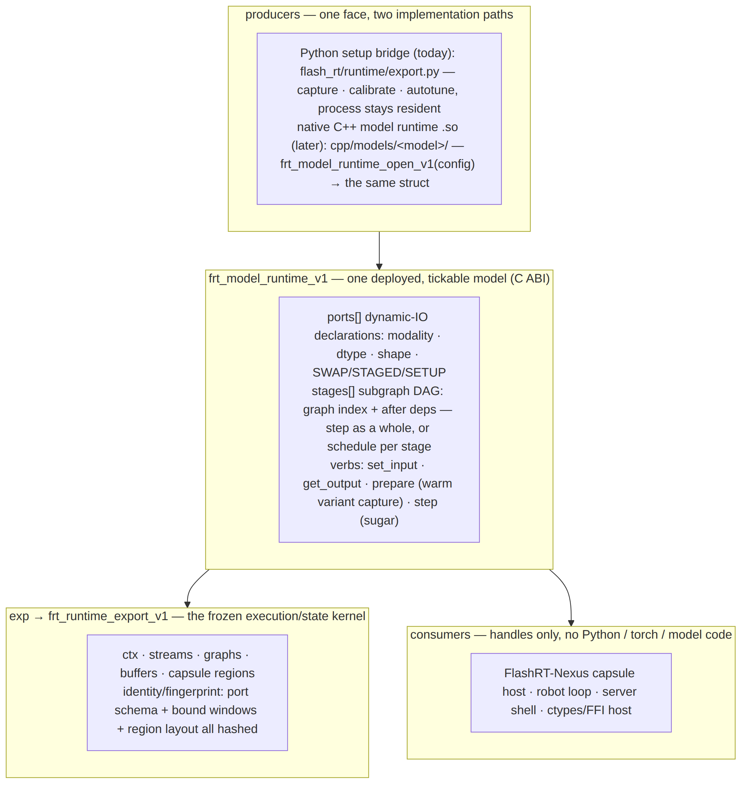
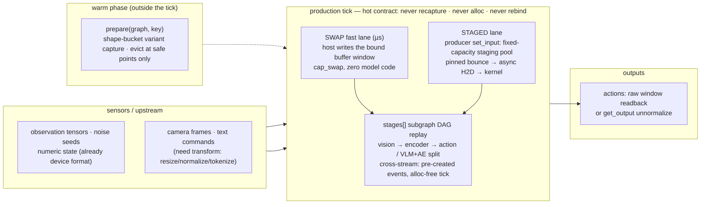

# FlashRT Native C++ Runtime — Design

The native runtime path exists for one reason: physical-AI production ticks
need white-box, hard-real-time discipline — bounded tail latency,
high-frequency state updates, long-run stability — that a Python hot loop
cannot promise. This document is the structure map; the interface reference is
[`model_runtime_api.md`](model_runtime_api.md) and the layer norms are
[`runtime_contract.md`](runtime_contract.md).

## One struct, two producers



Everything converges on `frt_model_runtime_v1` (the standard face of one
deployed, tickable model). The Python setup bridge produces it today; a native
model-runtime `.so` (`frt_model_runtime_open_v1`) produces the same struct
later. Consumers — FlashRT-Nexus, robot loops, FFI hosts — never change when
the producer does.

## Tree layout

```
runtime/                     the ONLY frozen surface (pure C ABI)
  include/flashrt/runtime.h        frt_runtime_export_v1  (execution/state kernel)
  include/flashrt/model_runtime.h  frt_model_runtime_v1   (ports · stages · verbs)
  src/                             builder + lifetime (no CUDA, no exec link)
  bindings/                        _flashrt_runtime (setup/dev bridge)

cpp/                         native implementation layers (NOT frozen)
  runtime/                   C++ manager interfaces (internal, may evolve)
  modalities/                reusable primitives: tensor views, vision
                             preprocess (CPU + CUDA), action postprocess,
                             the persistent VisionStaging pool
  families/<family>/         model-family contracts (e.g. VLA manifest)
  models/<model>/            thin adapters binding family + modality
                             primitives to concrete buffer names, shapes,
                             normalization, action schemas — and presenting
                             the generic face (frt_<model>_model_runtime_create)

flash_rt/runtime/export.py   the Python producer (same face, GIL-safe verbs)
```

Rule of altitude: `modalities/` knows pixels and tensors, never models;
`families/` knows a model class's IO shape, never buffer names; `models/`
binds names and constants, never re-implements a transform. Nothing under
`cpp/` is ABI — the struct in `runtime/` is the deployment surface.

## The production tick



Ports declare the update class; the class decides the lane:

- **SWAP** — the port is a device-buffer window; the host writes raw bytes
  directly (its own copy verb / `cap_swap`). Microsecond lane, zero model
  code in the loop.
- **STAGED** — the runtime's `set_input` transforms host data. The CUDA
  vision path runs on a fixed-capacity `VisionStaging` pool created with the
  runtime: memcpy to a pinned slot, async H2D, kernel. No `cudaMalloc` /
  `cudaFree` per frame; a frame over capacity is a hard error, never a
  fallback allocation.
- **SETUP** — legal only outside the tick.

Hot contract for both hot lanes (pinned by tests, not just prose): never
recapture, never allocate, never rebind graph pointers — only buffer contents
change, and replay output tracks them.

## Graph-variant cache

Each `frt_graph` is a ShapeKey→exec table, optionally bounded by
`max_variants` (LRU). The exec layer provides the cache **mechanism** —
`frt_graph_evict`, `frt_graph_evict_lru`, `frt_graph_variant_count` — and the
model runtime provides the warm-phase capture door (`prepare`). Eviction and
budget **policy** live in the host (e.g. a Nexus graph store). Discipline:
fixed-shape or bucket-keyed graphs in production; hot-path misses fail loudly
(`FRT_ERR_NO_VARIANT`); evict only at a safe point, never while a variant may
be in flight.

## Freeze and evolution

`runtime/include/flashrt/*.h` is additive-only after v1: append fields (bump
ABI version + struct_size), append enum values, never reorder or remove.
Everything under `cpp/` may be refactored freely as long as the produced
struct — and the identity it fingerprints — is preserved.
